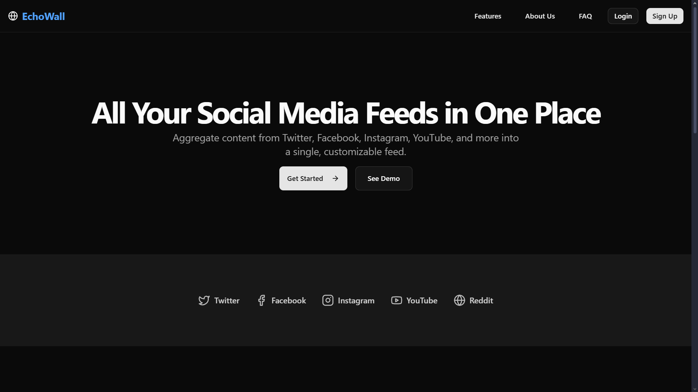
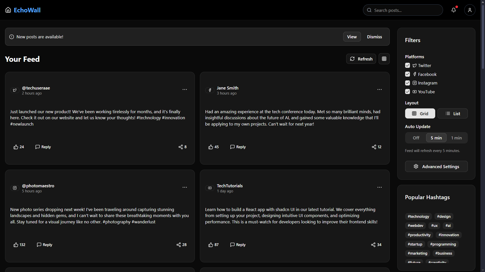

# EchoWall

A unified social feed aggregator that pulls content from multiple platforms into a single, streamlined feed. View, filter, and interact with all your social content in one place!

## 📌 Project Overview

This application serves as a centralized hub for your social media content, eliminating the need to switch between multiple apps. It aggregates posts from various platforms into one seamless feed, providing a more efficient and pleasant social media experience.

## ✨ Key Features

- **Unified Feed:** View posts from all your connected social media platforms in one place
- **Filter Options:** Easily filter content by platform or content type
- **User Authentication:** Simple login and signup for personalized access.
- **User Profiles & Settings:** Manage your profile details and app preferences
- **FAQ & Help Section:** Quick answers to common questions
- **Privacy & Terms:** Transparent information about how your data is handled

## 🖥️ Demo

Check out our live deployment: [EchoWall](https://echo-wall.onrender.com)

## 📸 Screenshots


*Our landing page*


*Our feed with content filtering options*

## 🚀 Getting Started

### Prerequisites

- Node.js (v16+)
- npm or yarn

### Installation

1. Clone the repository:
   ```bash
   git clone https://github.com/ChronoShiftJU/echo-wall
   cd echo-wall
   ```

2. Install dependencies:
   ```bash
   npm install
   ```

3. Build the application:
   ```bash
   npm run build
   ```

4. Start the client:
   ```bash
   npm run start_client
   ```

5. Open your browser and navigate to `http://localhost:5000`

## 💻 Tech Stack

- **Frontend Framework:** React + Vite + TypeScript
- **Styling:** Tailwind CSS + shadcn/ui
- **Routing:** React Router
- **Backend:** Node, Express, MongoDB
- **Encryption:** bcrypt
- **APIs:** YouTube Data API v3, Reddit API v2

## 👥 Credits

This project was created for **IEMHacks 3.0 2025** by our team x11.core:

- [Pritam Das](https://linkedin.com/in/pritamdas2006)
- [Suparno Saha](https://linkedin.com/in/letsbecool9792)
- [Sagnik Goswami](https://linkedin.com/in/sagnikgos06)

## 📞 Contact

For any questions or feedback, please open an issue or contact the team on the above links!

---

<p align="center">Made with ❤️ for IEMHacks 3.0 2025</p>
